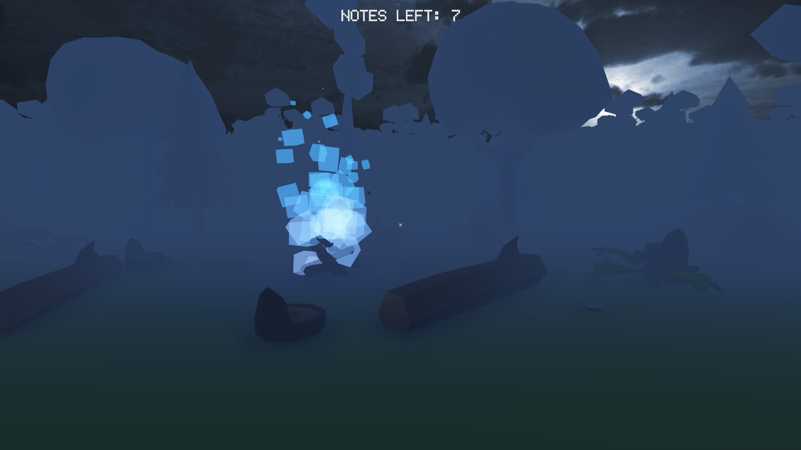
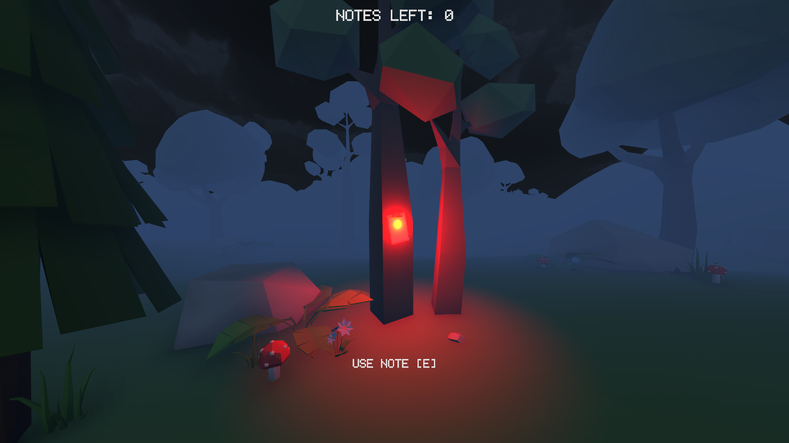
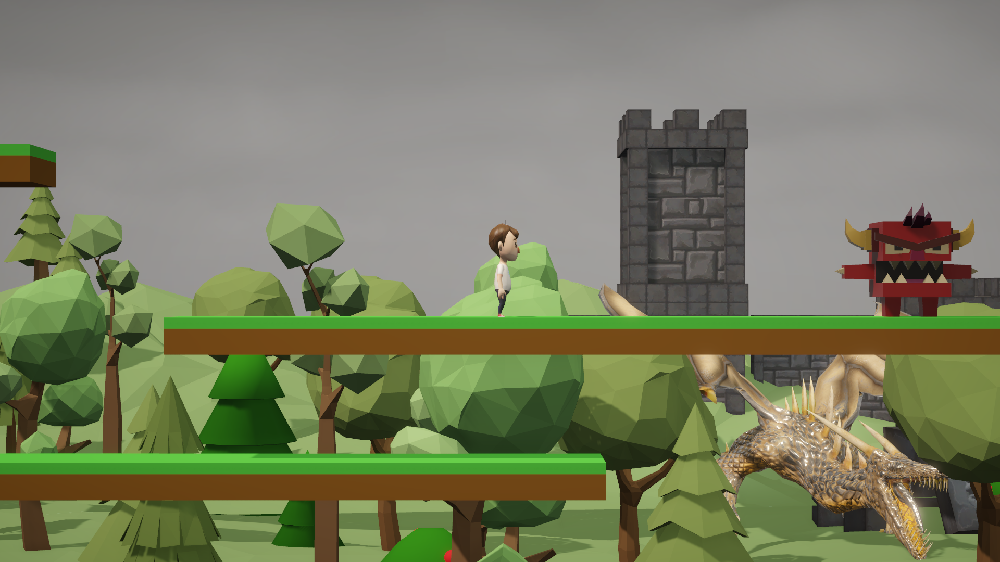
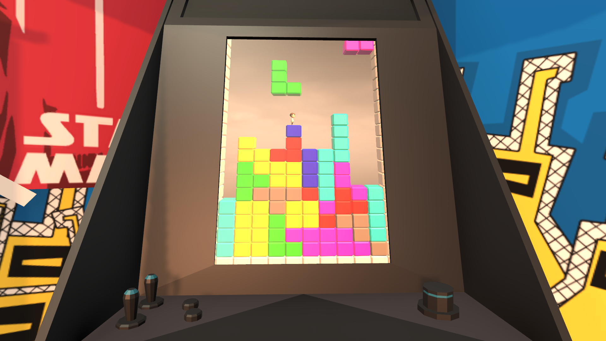

# CrashPast
*Game created on a 20Hour 7th WSEI GameJam with "nostalgia" theme.*

### Screenshots

**MENU** 

**NOTES TO COLLECT** 

**MARIO** 

**TETRIS** 

### Credits
**owr🙈#6062** - Game&Level designer [Forest]

**arystokeles#2844** - Game&Level designer [Mario]

**Piotrek2#4848** - Game&Level designer [Tetris]

**BOBUS#0521** - DJ, Game assets & SFX management, team coordinator

**xAxee#4835** - UI Designer.
